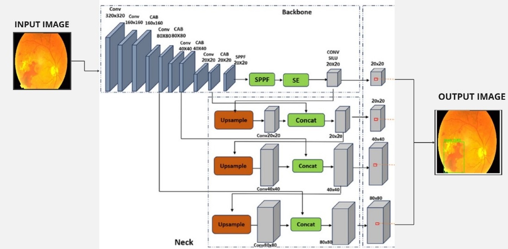
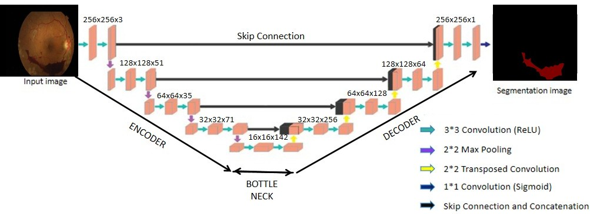
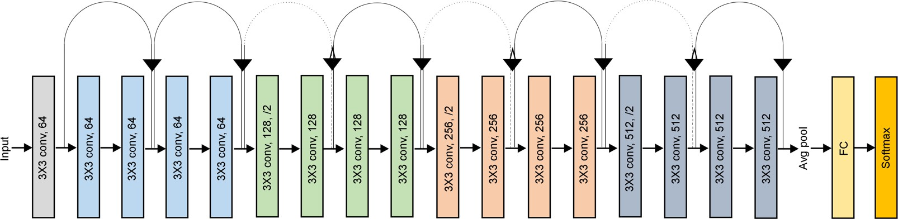

# Diabetic Retinopathy Detection, Segmentation, and Classification Using YOLOv8, MultiResUNet, and ResNet-18

## Overview
This project integrates Object Detection, Segmentation, and Classification to assist in early Diabetic Retinopathy (DR) diagnosis using deep learning.

- **YOLOv8** → Detects optic discs, hemorrhages, hard exudates, and lesions
- **MultiResUNet** → Segments optic discs and blood vessels
- **ResNet-18** → Classifies DR severity (Normal, Moderate, Severe)

## Architectures

### YOLOv8 – Object Detection
You Only Look Once (YOLOv8) is a real-time object detection model that localizes and identifies multiple DR-related lesions in fundus images.

**Key Features:**

- Anchor-free design improves small object detection (e.g., microaneurysms).
- Uses CBL (Convolution, BatchNorm, LeakyReLU) blocks for feature extraction.
- Decoupled Head for separate classification and localization.
- Strong data augmentation (Mosaic, CutMix, Albumentations) enhances generalization.

**YOLOv8 Architecture:**

### MultiResUNet – Segmentation
MultiResUNet is an enhanced version of UNet, designed to segment optic discs and blood vessels in retinal images.

**Why MultiResUNet?**

- Combines MultiRes blocks instead of simple convolutions to capture fine-grained features.
- Uses residual connections to improve gradient flow.
- Atrous convolutions capture multi-scale features for better segmentation accuracy.
- Outperforms traditional UNet in small object segmentation (e.g., tiny vessels).

**MultiResUNet Architecture:**

### ResNet-18 – Classification
ResNet-18 (Residual Network) is a deep CNN used to classify DR severity levels (Normal, Moderate, Severe).

**Key Features:**

- Uses skip connections (residual learning) to solve the vanishing gradient problem.
- 18 convolutional layers with ReLU activation for feature extraction.
- Global Average Pooling (GAP) layer replaces fully connected layers for better generalization.
- Trained with categorical cross-entropy loss and Adam optimizer for optimal performance.

**ResNet-18 Architecture:**

